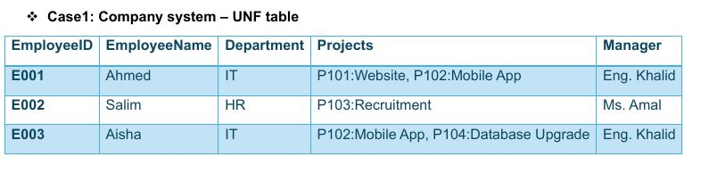
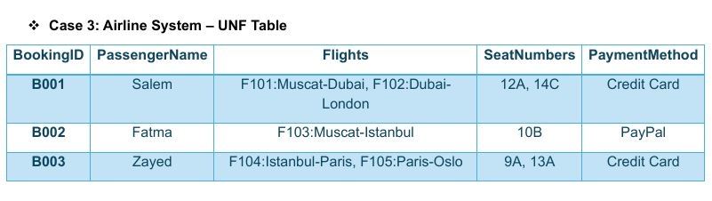
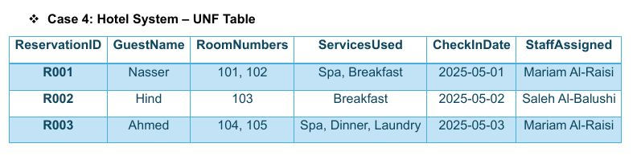
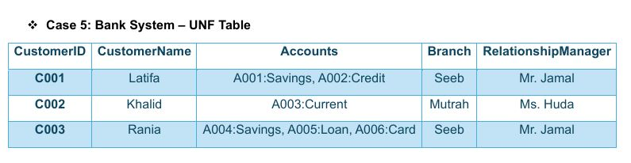
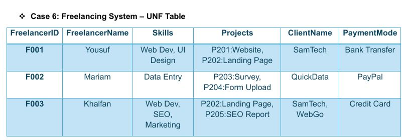

# Normalization Practice 
## Case1: Company system – UNF table

Problem: Have multivalue attribute in the table 
Solution: seprate multivalue attribute into a new table

| EmployeeID | EmployeeName | Department | Manager |
|---|---|---|
| E001 | Ahmed | IT | Eng. Khalid |
| E002 | Salim | HR | Ms. Amal |
| E003 | Aisha | IT | Eng. Khalid |

| EmployeeID | Projects|
|---|----|
| E001 | P101:Website |
| E001 | P102:Mobile App |
| E002 | P103:Recruitment |
| E003 | P102:Mobile App |
| E003 |  P104:Database Upgrade |

## Case 2: University System – UNF Table
           
Problem: Have multivalue attribute and transitive dependencies in the table
Solution: seprate multivalue attribute into a new table and remove transitive dependencies

| StudentID | StudentName |
|----|---|
| S001 | Reem |
| S002 | Tariq |
| S003 | Noura |

| StudentName | Department | Advisor |
|---|---|---|---|
| Reem | CS | Dr. Omar |
| Tariq | Business | Dr. Sarah |
| Noura | CS | Dr. Omar |

| StudentName | Courses Enrolled |
|---|---|
| Reem | C101:DB |
| Reem | C102:AI |
| Tariq | C103:Marketing |
| Noura | C101:DB |
| StudentName | C104:Cybersecurity |

## Case 3: Airline System – UNF Table

Problem: Have two multivalue attributes in the table 
Solution: seprate multivalue attributes into a new table

| BookingID | PassengerName | PaymentMethod |
|---|---|---|
| B001 | Salem | Credit Card |
| B002 | Fatma | PayPal |
| B003 | Zayed | Credit Card  |

| BookingID | Flights | 
|---|---|
| B001 | F101:Muscat-Dubai |
| B001 | F102:Dubai-London |
| B002 | F103:Muscat-Istanbul |
| B003 | F104:Istanbul-Paris |
| Boo3 | F105:Paris-Oslo |

| BookingID | SeatNumbers | 
|---|---|
| B001 | 12A |
| B001 | 14C |
| B002 | 10B |
| B003 | 9A |
|Boo3 | 13A |

## Case 4:  Hotel System – UNF Table

Problem: Have two multivalue attributes in the table
Solution: seprate multivalue attributes into a new table

| ReservationID | GuestName | CheckInDate | StaffAssigned |
|---|---|---|---|
| R001 | Nasser | 2025-05-01  | Mariam Al-Raisi |
| R002 | Hind | 2025-05-02   | Ahmed Al-Mansoori |
| R003 | Ahmed | 2025-05-03  | Mariam Al-Raisi |

| ReservationID | RoomNumbers |
|---|---|
| R001 | 101 |
| R001 | 102 |
| R002 | 103 |
| R003 | 104 |
| R003 | 105 |

| ReservationID | ServicesUsed | 
|---|---|
| R001 | Spa |
| R001 | Breakfast |
| R002 | Breakfast |
| R003 | Spa |
| R003 | Dinner |
| R003 | Laundry |

## Case 5:  Bank System – UNF Table

Problem: Have multivalue attribute in the table
Solution: seprate multivalue attribute into a new table

| CustomerID | CustomerName | Branch | RelationshipManager |
|---|---|---|---|
| C001 | Latifa | Seeb | Mr. Jamal |
| C002 | Khalid | Mutrah | Ms. Huda |
| C003 | Rania | Seeb | Mr. Jamal |

| CustomerID | Accounts |
|---|---|
| C001 | A001:Savings |
| C001 | A002:Credit |
| C002 | A003:Current |
| C003 | A004:Savings |
| C003 | A005:Loan |
| C003 | A006:Card |

## Case 6: Freelancing System – UNF Table

Problem: Have two multivalue attributes in the table
Solution: seprate multivalue attribute into a new table and remove composite key( to  All non-key attributes must depend on the whole primary key (not part of it)).
| FreelancerID | FreelancerName | PaymentMode |
|---|---|---|---|
| F001 | Yousuf | Bank Transfer |
| F002 | Mariam | PayPal |
| F003 | Ahmed  | Credit Card |

| FreelancerID | Skills |
|---|---|
| F001 | Web Dev |
| F001 | UI Design |
| F002 | Data Entry |
| F003 | Web Dev |
| F003 | SEO |
|F003 | Marketing |

| FreelancerID | Projects |
|---|---|
| F001 | P201:Website |
| F001 | P202:Landing Page |
| F002 | P203:Survey |
| F002 | P204:Form Upload |
| F003 | P202:Landing Page |
| F003 | P205:SEO Report |

| FreelancerID | ClientName |
|---|---|
| F001 | SamTech |
| F002 | QuickData |
| F003 | SamTech |
| F003 | WebGo |
